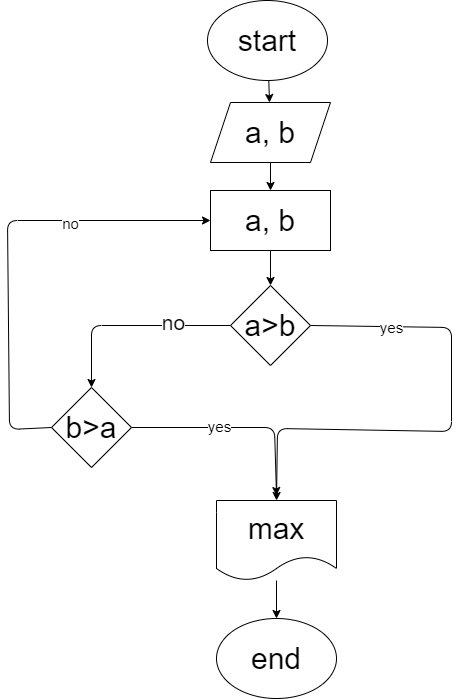
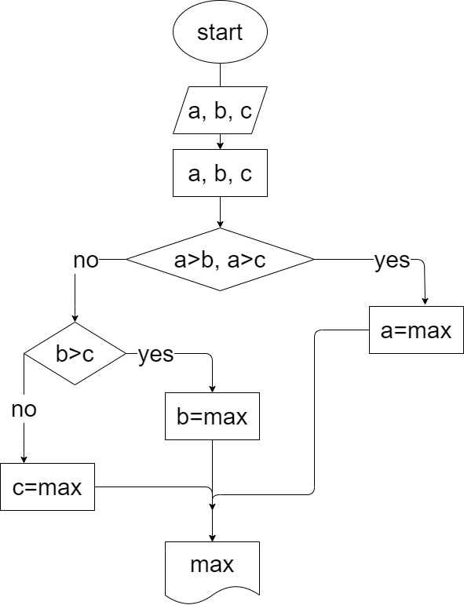

 - Homework
 - Lecture
 - Seminar
   - Seminar001

    Ex001
    ### Напишите программу, которая на вход принимает 2 числа и выдаёт, какое число большее, какое меньшее.

    a=5; b=7 -> max=7

    a=2; b=10 -> max=10

    a=-9; b=-3 -> max=-3

    |
    
     [код](Seminar/Seminar001/Ex001/Program.cs) 

    

    Ex002
    ### Напишите программу, которая принимает на вход три числа и выдаёт максимальное из этих чисел.

    2, 3, 7 ->7

    44, 5, 78 ->78

    22, 3, 9 ->22

    |

    [код](Seminar/Seminar001/Ex002/Program.cs)

    
    

    Ex003

    Ex004

   - Seminar002
   - Seminar003